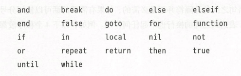
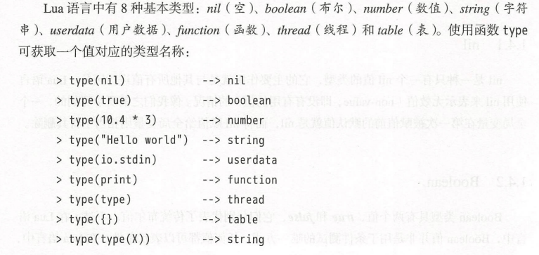
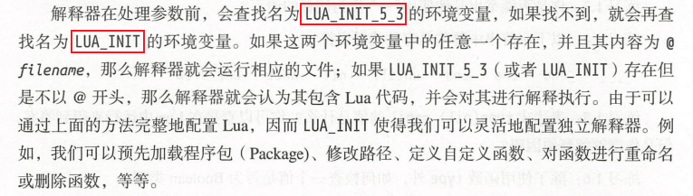
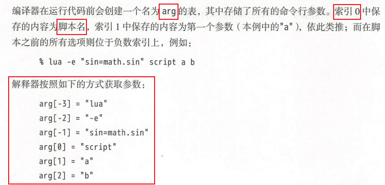
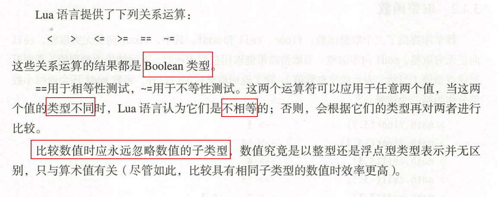
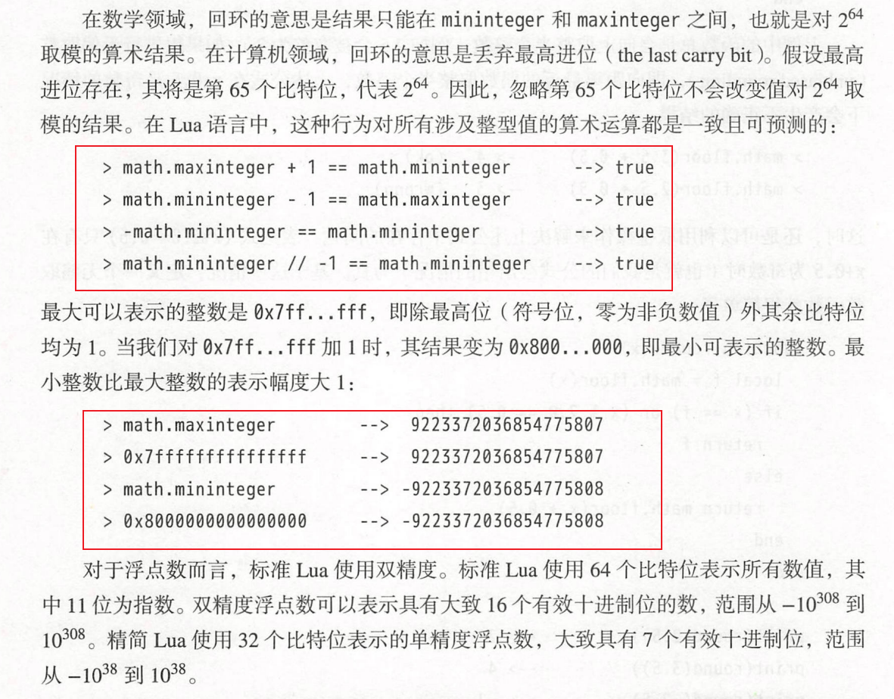
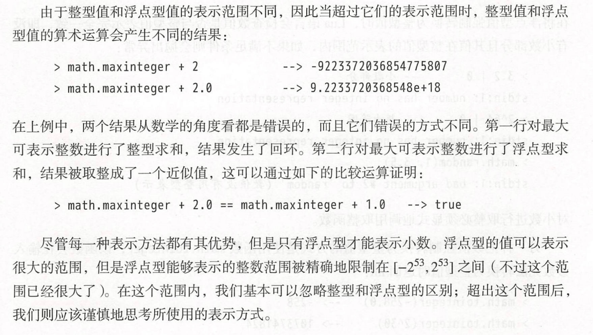
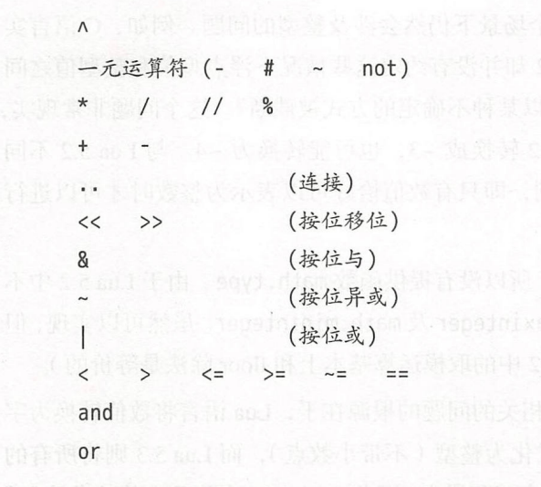
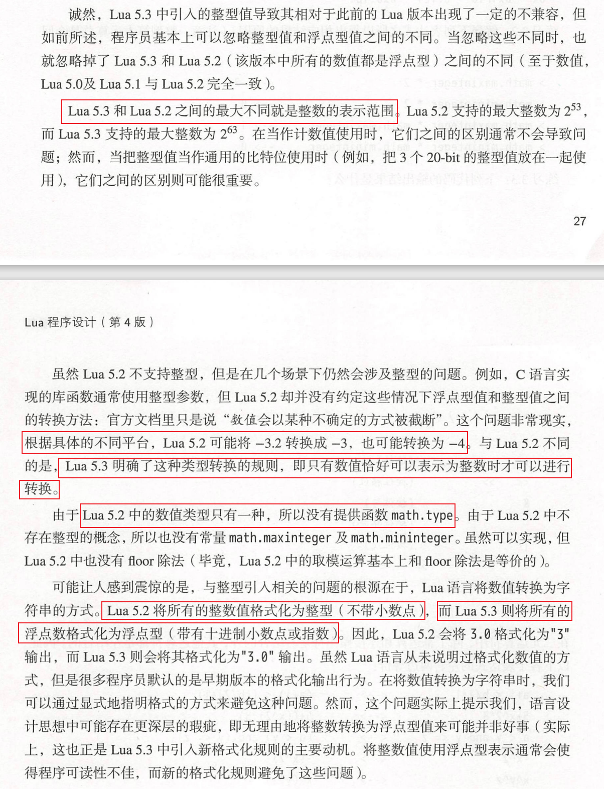

# 一、Lua语言入门

>    安装**Lua解释器**分为两种方法：
>
>   1.   下载源码然后编译成二进制文件 `make ...`
>   2.   直接下载可运行的二进制文件，然后在环境变量Path中添加该二进制文件所处的文件夹位置

## 1 程序段

**程序段**：一个文件或者交互模式下的一行

从5.3版本开始，在**交互模式**下可以直接输出表达式的值，而之前的版本需要在表达式前面加上`=`

**独立解释器**的各种参数：


## 2 词法规范

Lua的**保留字**：

**注释**：

-   单行注释：`-- 注释内容`
-   多行注释：`-- [[ 注释内容 ]]`


## 3 变量

**全局变量**：

-   只要是没有声明为local的变量都默认是全局变量，且**全局变量无需声明就可以使用**，不过值为`nil`。

-   Lua不会区分未初始化的变量和值为nil的变量，当一个变量为nil后，Lua会最终回收该变量占用的内存
-   全局变量存储在`_G`这个table中


**局部变量**：

-   局部变量在使用前必须先声明`local var`
-   局部变量的作用域和生命周期有限，作用域终止于声明变量的代码块中的**最后一个有效语句处**（goto的标签是无效语句）
-   可以通过`do ... end`控制局部变量的生效范围
-   局部变量的访问速度更快，应该优先使用局部变量，例如常用`local math_random = math.random`来提高访问速度


## 4 类型和值

>    Lua是动态类型语言，无需定义变量的类型




## 5 独立解释器

 Lua命令的完整参数形如：`lua [options] [script [args]]`

解释器处理参数前`LUA_INIT`：



解释器处理参数时`arg`：




## 6 控制结构

### 6.1 if-then-elseif-else

>   Lua不支持switch语句

```lua
if i == 0 then
    print(i)
elseif i == 1 then
    print(i + 1)
else
    print(i - 1)
end
```


### 6.2 while-do

```lua
while i == 0 do
    i = i + 1
    print(i)
end
```


### 6.3 repeat-until

>   until中的测试条件能够访问循环体中声明的局部变量

```lua
local x = 10
local sqr = x / 2
repeat
    sqr = (sqr + x / sqr) / 2
    local error = math.abs(sqr ^ 2 - x)
until error < x / 1000
```


### 6.4 for-do

 for分为数值型for和泛型for

-   数值型for ：循环开始前，三个表达式都运行一次；控制变量`var`是for语句自动声明的局部变量

    ```lua
    for var = startExpr, endExpr, stepExpr do
    	--something--
    end
    ```

-    泛型for（TODO）：形如

    ```lua
    for k, v in pairs(t) do
        --something--
    end
    ```

    

### 6.5 break、return 和 goto

-   break：结束最内层的循环

-   return：只能是**代码块的最后一句**

    ```lua
    function foo()
        return   --<< 语法错误
        do return end  -- OK
        --something--
    end
    ```

-   goto：跳转至对应的标签处继续执行，正确使用goto可以实现Lua中没有的一些功能，例如continue, redo等

    ```lua
    while some_condition do
        ::redo::
        
        if some_other_condition then
            goto continue
        else
            goto redo
        end
        
        --something--
        
        ::continue::
    end
    ```

    


# 二、八种类型

## 1 nil

nil类型只有一个值nil，主要就是用于和其它值进行区分。当全局变量被赋值为nil后，最终会导致该变量被回收内存空间。

## 2 boolean

boolean类型有两个值：true和false

-   false：fasle和nil
-   true：其他所有的值

**逻辑运算符**：and、or和not

-   `a and b or c`：

    ```lua
    if a then
    	return b
    else 
    	return c
    end
    ```

-   `a = a or b`：常用于不能确定a是否是nil时给a初始化

    ```lua
    if not a then
        a = b
    end
    ```

-   `not a`：永远返回boolean类型的值


## 3 number

对于Lua5.3之前的版本，所有的数值都是**双精度浮点数**。从Lua5.3开始，为数值提供了两种选择：integer（**64位整型**）和float（**双精度浮点数**），对于资源受限的平台，会编译为 Small Lua 模式，使用32位整型和单精度浮点数。

### 3.1 数值常量

-   具有十进制小数或者指数的数值会被当作float，否则是integer
-   float和integer的类型都是number，他们可以相互转化。并且具有相同算数值的integer和float是相等的
-   可以通过`math.type`来区分integer和float
-   支持0x开头的16进制常量，并且还支持16进制的浮点数


### 3.2 算术运算

```lua
1 + 1 --> 	2
1.0 + 1.0 --> 	2.0
1 + 1.0 --> 	2.0
5 / 2 --> 	2.5
5.0 / 2 -->	2.5
5 // 2 -->	2.5
5.0 // 2 -->	2.5
4.0 / 2.0 -->	2.5
3.1415 - 3.1415 % 0.01 --> 	3.14
2 ^ 3 -->	8.0
2 ^ 3.1 -->	8.5741877002903
8 ^ (1 / 3) -->	2.0
```


 ### 3.3 关系运算




### 3.4 表示范围





-   将integer转换为float：`+ 0.0`

-   将float转换为integer：

    -   `|0`：在转化时会检查是否是小数并且值在整型值的表示范围内，不满足就会抛出异常

    -   `math.tointeger()`：该函数会在输入 参数无法转换为整型值时返回 nil

        

        

### 3.5 运算符优先级

>   应该尽量使用括号`()`，而不是考虑运算符的优先级




### 3.6 兼容性问题



## 4 string

>   Lua中的string既可以表示单个字符，也可以表示字符串，既可以用单引号`''`也可以用 双引号`""`

string 是不可变值，只能通过创建一个新的 string 来达到修改的目的，并且Lua会负责string的分配和释放。

获取字符串的长度可以通过 `#str`来实现，它返回的是该string的**字节数**。

连接字符串可以通过`str1 .. str2`来实现，如果操作数中存在数值，则会把该数值转换为字符串然后进行连接操作：

`print(1 .. 2) --> "12"`


### 4.1 多行字符串

```lua
page = [[
<html>
<head>
	<title> An HTML Page </title>
</head>
...
]]

print(page)
```

`\z`转义字符能够跳过所有的空白字符，直到遇到第一个非空白字符


### 4.2 强制类型转换

-   自动强制类型转换：

    ```lua
    print(1 .. 2) --> "12"
    print("10" + 2) --> 12  默认是浮点数
    ```

-   手动强制类型转换：

    ```lua
    ------- tonumber --------
    print(tonumber(" -3")) --> -3
    print(tonumber(" -3e")) --> nil
    print(tonumber(" -3e1")) --> -30.0
    print(tonumber("fff", 16)) --> 4095
    print(tonumber("987", 8)) --> nil
    ------- tostring ---------
    print(tostring(12)) --> "12"
    print(tostring(12) == "12") --> true
    ```

-   比较运算符不会进行类型转换：

    ```lua
    print(2 < 15) --> true
    print("2" < "15") --> false
    print(2 < "15") --> 异常
    ```


### 4.3 Unicode和UTF-8

>   TODO


## 5 table

>   表  Table 是 Lua 语言中**唯一**的数据结构

table的索引可以是 数值，也可以是 字符串 或者其他任意类型的值（Nil除外）

table永远是匿名的，程序只能操作指向table的**引用**，当一个table没有指向它的引用时，gc会最终删除这个表和释放其内存

### 5.1 table的增删改查


```lua
t = {[1]="a", ["a"] = 1}
t[2] = "b"
t["b"] = 2
print(t[1], t[2])
print(t["a"], t.b)
t[1] = "A"
t.a = "一"
print(t[1], t[2])
print(t["a"], t.b)
t[2] = nil
t["b"] = nil
print(t[1], t[2])
print(t["a"], t.b)

---OUTPUT---
a	b
1	2
A	b
一	2
A	nil
一	nil
```


### 5.2 table的索引

-   同一个表可以有不同类型的索引

-   `t.name` 和 `t["name"]` 等价，和 `t[name]` 不等价

-   当浮点数被用作table的索引时，只要能转换成整数型，就会被转换成整数型作为索引

    ```lua
    t = {}
    t[2.0] = 10
    t[2.1] = 20
    print(t[2])
    print(t[2.0])
    print(t[2.1])
    
    ---OUTPUT---
    10
    10
    20
    ```


### 5.3 table的构造器

-   **普通构造器**：`t = {[1] = "a", [2] = "b", ["a"] = 1, ["b"] = 2}`
-   **列表式构造器**：`t = {"a", "b"}`
-   **记录式构造器**：`t = {a = 1, b = 2}`


### 5.4 数组和序列

数组：索引只有整数型的table

序列：所有元素不为nil的数组

操作符`#`：返回字符串的**字节数**；返回**序列**的长度，对于中间有nil或空洞的数组，`#`操作是**不靠谱的**

```lua
t = {"a"}
print(#t)
t[2] = "b"
print(#t)
t[3] = nil
print(#t)
t[4] = "d"
print(#t)
t[5] = nil
print(#t)
--t[2.1] = nil
--print(#t)
--t["a"] = 1
--print(#t)
t[6] = "f"
print(#t)
--t[-1] = "A"
--print(#t)
for k, v in pairs(t) do
    print(k, v)
end

---OUTPUT---
1
2
2
4
4
4
1	a
2	b
4	d
6	f
```

### 5.5 table的遍历

-   `pairs`：遍历所有的非nil键值对，但是每次遍历的顺序可能不同
-   `ipairs`：遍历列表，每次保证按照顺序进行

**TODO：需要看实现的源码**


### 5.6 table的安全访问

当不能确定某个table是否存在时，我们尝试访问它的某个key，往往需要使用如下形式：

```lua
if t and t.x then
    -- 逻辑 --
end
```

但是这种方式当嵌套深度比较深时往往比较低效，例如：

```lua
zip = company 
	  and company.director
	  and company.director.address
	  and company.director.address.zipcode
```

此时成功访问会对表进行6次访问而不是3次，因此在Lua中可以使用如下形式：

```lua
zip = (((company or {}).director or {}).address or {}).zipcode
```


## 6 function

>   函数定义形如：`function f(args) -- 函数体 -- end`
>
>   调用函数时形如：`f()`
>
>   -   当 **只有一个参数** 并且该参数是 **字符串常量或者表构造器** 时，可以省略括号
>   -   调用函数时参数个数可以和定义函数时不一致，多的丢弃，少的设为nil


### 6.1 多返回值

Lua中函数返回多个返回值形如：

```lua
function f() 
	return val1, val2
end
```

但是Lua会根据**函数被调用的情况**调整返回值的个数：

-   0个返回值：函数被作为一条单独的语句调用时，丢弃所有返回值
-   1个返回值：**当函数没有返回值时，强行返回nil**
    1.   函数被作为表达式（例如`+`或者`..`的操作数）调用时
    2.   函数调用在**一系列表达式**中，但是不**是最后一个表达式**
    3.   用`()`括住函数调用时
-   多个返回值：函数调用在**一系列表达式**中，并且**是最后一个表达式**，一系列表达式包括下面4种情况：
    1.   多重赋值
    2.   函数调用时传入的实参
    3.   表构造器
    4.   `return`语句


### 6.2 可变长参数

>   Lua 中使用三个点 `...` 来表示**可变长参数**，这些所有的参数也成为 **额外参数**

传入时：`...` 必须放在参数列表最后

使用时：该表达式`...`返回的是当前函数的所有可变长参数(类似于多个返回值)

-   `{...}`：返回所有可变长参数组成的列表
-   `table.pack(...)`：和`{...}`一样，但同时返回的表中还保存了额外字段`n`表示额外参数的总个数。与之相对应的是函数`table.unpack(list, i, j)`，返回列表list中索引 i(`i = i or 1`) 到 j(`j = j or #list`) 之间的元素
-   `select(selector, ...)`：selector是数值n，返回第n个参数及之后的所有参数；selector是`"#"`，返回额外参数的总个数

```lua
local function checkNils(...)
    print(#{...})
    for k, v in pairs({...}) do
        print(k, v)
    end

    local variableArgs = table.pack(...)
    for k, v in pairs(variableArgs) do
        print(k, v)
    end
    for i = 1, variableArgs.n do
        print(i, variableArgs[i])
    end

    print(select(1, ...))
    print(select(2, ...))
    print(select("#", ...))


    local a, b, c = ..., "hello"
    print(a, b, c)
    local x, y, z = "world", ...
    print(x, y, z)
end
checkNils(1, nil, 3, nil)

--[[
OUTPUT:
1
1	1
3	3
1	1
3	3
n	4
1	1
2	nil
3	3
4	nil
1	nil	3	nil
nil	3	nil
4
1	hello	nil
world	1	nil
--]]

```

### 6.3 正确的尾调用

>   **尾调用** 指的是当一个函数的最后一个动作是调用另一个函数，而没有再进行任何其他工作时，就形成了尾调用

因为尾调用之后，调用函数不再执行任何工作，因此不需要在调用栈中保存调用函数的任何信息。所以可以直接在调用函数的栈空间中执行被调用函数（猜的），不需要开辟新的栈空间，即 **尾调用消除**。在这种机制下，可以嵌套的尾调用的数量是无限的，即不会发生栈空间溢出（stackflow）的情况。

在Lua中，只有形如 `return func(args)` 的才是尾调用。


## 7 userdata


## 8 thread


# 标准库

## 数学标准库math


## 字符串标准库string


## 表标准库table


## 输入输出库io

